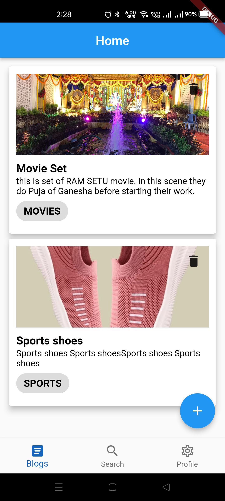
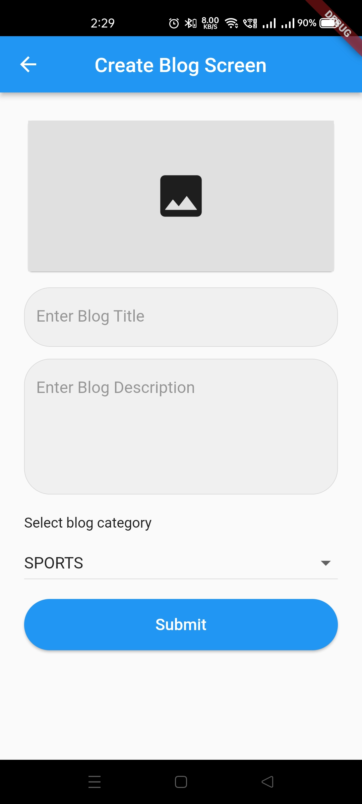
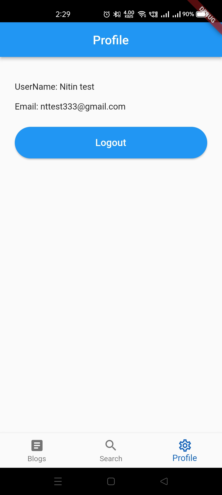

# blog_app

Blog Application

### Features

1.  Login with Email and Password ( nttest333@gmail.com, 123456 )
2.  Login with Google
3.  Create Blog with Image ( Real time feed )
4.  User small profile section

### Task Done as follow

- [x] Solid state management (BLoC)
- [x] Clean architecture.
- [x] Project pattern (MVC/MVVM)
- [x] Attach the readme file & App Screenshot in the readme file.
- [x] Testable code.
- [x] UI is not important but the flow of the app should be easy and smooth.

### Attachments

| Home Screen                                     | Create Blog Screen                              | Profile Screen                                 |
| ----------------------------------------------- | ----------------------------------------------- | ---------------------------------------------- |
|  |  |  |
